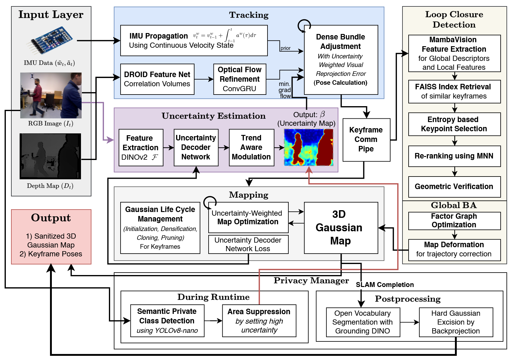

<h1 align="center">Privacy-Preserving Multimodal Gaussian SLAM with Cycle-Aware Uncertainty Refinement and Zero-Shot Mamba Re-Ranking</h1>

<p align="center">
<strong>Adarsh Gupta (B. Tech. CSE IIT Guwahati) - BTP Phase 2</strong>
</p>

<p align="center">
    
</p>

<p align="center">
<em>System architecture of the enhanced privacy-preserving multimodal Gaussian SLAM.</em> The pipeline uses RGB-D and IMU data for tracking, optimizing keyframe poses through uncertainty-weighted Dense Bundle Adjustment (DBA). Building on the MMG-SLAM baseline (with IMU propagation and MambaVision-based retrieval), it introduces three key additions. First, a cycle-aware uncertainty module with trend-aware modulation improves gradient flow, helping retain temporarily occluded static regions during tracking and mapping. Second, a dual-stage privacy manager combines real-time detection (YOLOv8-nano) to mask sensitive areas by increasing uncertainty, with an offline pass (Grounding DINO) that removes them geometrically. Third, a zero-shot VPR re-ranking module extracts features from MambaVision attention maps, using entropy-based keypoint selection and mutual nearest neighbor matching for improved loop closure. The system produces a globally consistent, robust, and privacy-preserving 3D Gaussian map with optimized trajectories.
</p>

<br>

## Overview

This project extends multimodal 3D Gaussian Splatting SLAM with three key contributions that address **robust loop closure under appearance change**, **failure modes in uncertainty-based dynamic handling**, and **privacy preservation in persistent 3D maps**:

1. **Zero-Shot MambaVision Re-Ranking for Loop Closure**
   Introduces a two-stage loop closure pipeline that leverages internal attention representations of MambaVision for spatial verification without additional networks. Global descriptors are retrieved using FAISS, followed by entropy-based keypoint selection and mutual nearest neighbor (MNN) matching for re-ranking. This achieves near state-of-the-art accuracy with significantly reduced latency.

2. **Cycle-Aware Uncertainty Refinement**
   Resolves a critical cyclic failure mode in uncertainty-based SLAM where static regions become permanently excluded after transient occlusions. The method enforces a minimum optimization weight to guarantee gradient flow and applies trend-aware modulation using an exponential moving average of uncertainty to accelerate recovery of misclassified static regions.

3. **Privacy-Preserving Gaussian Excision Pipeline**
   Introduces a hybrid online-offline privacy mechanism. During runtime, sensitive regions are detected (e.g., via YOLOv8) and suppressed by injecting high uncertainty. In a post-processing stage, Grounding DINO-based detection enables precise geometric removal of privacy-sensitive Gaussians. This ensures that exported maps are free from reconstructable sensitive content while preserving tracking and rendering quality.

The system produces a **globally consistent, robust, and privacy-preserving 3D Gaussian map** with optimized trajectories, suitable for real-world deployment.

### Key Results

| Benchmark                     | Metric                 | Result                                               |
| ----------------------------- | ---------------------- | ---------------------------------------------------- |
| **TUM RGB-D**                 | ATE RMSE               | **1.46 cm (state-of-the-art)**                       |
| **VIODE (9 sequences)**       | ATE RMSE               | **2.67 m (↓17.8% vs baseline)**                      |
| **VIODE (9 sequences)**       | PSNR                   | **21.06 dB (↑8.28%)**                                |
| **Cycle-Aware Recovery**      | Static Region Recovery | **Prevents permanent exclusion of occluded regions** |
| **Loop Closure (Re-ranking)** | Accuracy vs Latency    | **~97% of SOTA accuracy with reduced overhead**      |
| **Loop Closure (Re-ranking)** | Latency Overhead       | **↓18% vs attention-based reranking methods**        |
| **Privacy (BONN Dynamic)**    | Re-ID Score            | **≈ 0 (near-perfect anonymization)**                 |
| **Privacy (All datasets)**    | ATE / PSNR Impact      | **No degradation vs baseline**                       |

<br>

<!-- TABLE OF CONTENTS -->
<details open="open" style='padding: 10px; border-radius:5px 30px 30px 5px; border-style: solid; border-width: 1px;'>
  <summary>Table of Contents</summary>
  <ol>
    <li><a href="#overview">Overview</a></li>
    <li><a href="#system-architecture">System Architecture</a></li>
    <li><a href="#installation">Installation</a></li>
    <li><a href="#quick-demo">Quick Demo</a></li>
    <li><a href="#datasets">Datasets</a></li>
    <li><a href="#run">Run</a></li>
    <li><a href="#evaluation">Evaluation</a></li>
    <li><a href="#results">Results</a></li>
    <li><a href="#acknowledgement">Acknowledgement</a></li>
    <li><a href="#citation">Citation</a></li>
  </ol>
</details>

<br>

## System Architecture

The system consists of two concurrent processes communicating via multiprocessing pipes:

- **Tracking Frontend**: Extracts DROID features, builds correlation volumes, integrates IMU measurements for pose/velocity propagation, performs uncertainty-weighted Dense Bundle Adjustment (DBA), and selects keyframes based on motion magnitude and covisibility.
- **Mapping Backend**: Initializes 3D Gaussians from keyframes, optimizes Gaussian parameters with uncertainty-weighted rendering losses, trains the uncertainty prediction network (DINOv2 + lightweight decoder) online, and performs densification/pruning. After tracking completes, it constructs a factor graph with proximity and loop-closure edges, runs MambaVision-based loop closure, and performs sparse global bundle adjustment with map deformation.

### Contribution Details

#### 1. Zero-Shot MambaVision Re-Ranking

* **Stage 1 (Global Retrieval):**
  Extract 640-D L2-normalized descriptors using MambaVision-T and retrieve candidates via FAISS IndexFlatIP.

* **Stage 2 (Local Re-Ranking):**
  Use attention maps to extract local features. Keypoints are selected using entropy-based filtering and matched using Mutual Nearest Neighbor (MNN).

* **Key Insight:**
  MambaVision attention layers provide spatial correspondence “for free,” eliminating the need for separate feature extractors.


#### 2. Cycle-Aware Uncertainty Refinement

To prevent permanent exclusion of static regions:

* **Minimum Weight Floor:**
  Ensures all pixels receive gradients:

  ```
  w = max(0.5 / β², ε)
  ```

  where ε = 0.05

* **Trend-Aware Modulation:**
  Uses EMA of uncertainty:

  ```
  β_EMA = (1 − α) β_EMA + α β
  ```

  If uncertainty decreases, weights are boosted to accelerate recovery.

This breaks the cyclic failure loop and restores static geometry after occlusion.

#### 3. Privacy-Preserving Gaussian Excision

A hybrid pipeline:

1. **Detection** – Identify sensitive regions using open-vocabulary detectors
2. **Projection** – Map Gaussians to image space
3. **Aggregation** – Combine multi-frame privacy evidence
4. **Suppression** – Inject high uncertainty (β = 100) during training
5. **Excision** – Remove sensitive Gaussians before export

This ensures **privacy-safe 3D maps without degrading SLAM performance**.

## Installation (Environment Setup & Downloading pretrained weights)

1. Clone the repo with the `--recursive` flag (uses [anaconda](https://www.anaconda.com/)):
```bash
git clone --recursive https://github.com/CoolSunflower/Privacy-Preserving-SLAM.git
cd Privacy-Preserving-SLAM
```
2. Create a new conda environment:
```bash
conda create --name vslam_003 python=3.10
conda activate vslam_003
```
3. Install CUDA 11.8 and torch-related packages:
```bash
python -m pip install "setuptools<70"
python -m pip install numpy==1.26.3 # do not use numpy >= v2.0.0
conda install --channel "nvidia/label/cuda-11.8.0" cuda-toolkit
python -m pip install torch==2.1.0 torchvision==0.16.0 torchaudio==2.1.0 --index-url https://download.pytorch.org/whl/cu118
python -c "import torch; print(torch.__version__, torch.version.cuda, torch.cuda.is_available())"
python -m pip install torch-scatter -f https://pytorch-geometric.com/whl/torch-2.1.0+cu118.html
python -m pip install -U xformers==0.0.22.post7+cu118 --index-url https://download.pytorch.org/whl/cu118
```

NOTE: Point nvcc version to match cuda
```bash
# run `sudo apt install nvidia-cuda-toolkit` if `which nvcc` returns empty
# if ls /usr/local | grep cuda : shows cuda-11.8 as one of the options then you can skip the installation steps and jump to the environment variable pointing step at the bottom of this block...
# if `nvcc --version` says cuda != 11.8, then you need to install cuda toolkit and temporarily point the env vars for installation
# get download commands appropriately from https://developer.nvidia.com/cuda-11-8-0-download-archive 
# in my case:
wget https://developer.download.nvidia.com/compute/cuda/repos/ubuntu2204/x86_64/cuda-keyring_1.0-1_all.deb
sudo dpkg -i cuda-keyring_1.0-1_all.deb
sudo apt update

# then instead of 4th command:
sudo apt install cuda-toolkit-11-8 --no-install-recommends #note this is different from one mentioned on nvidia-documentation

During above if you get `nsight-systems-2022.4.2 : Depends: libtinfo5 but it is not installable`.
Then you need to install libtinfo5 manually... ex. for ubuntu 24.04
wget http://security.ubuntu.com/ubuntu/pool/universe/n/ncurses/libtinfo5_6.3-2ubuntu0.1_amd64.deb
sudo apt install ./libtinfo5_6.3-2ubuntu0.1_amd64.deb
# here you can ignore warnings for unsandboxed downloads
after fixing error, install: `sudo apt install cuda-toolkit-11-8`

# after installation completes (might take some time), point global vars:
ls /usr/local | grep cuda # should show cuda-11.8 as one of the options
export CUDA_HOME=/usr/local/cuda-11.8
export PATH=$CUDA_HOME/bin:$PATH
export LD_LIBRARY_PATH=$CUDA_HOME/lib64:$LD_LIBRARY_PATH
sudo apt install gcc-11 g++-11
export CC=gcc-11
export CXX=g++-11

nvcc --version # should now show cuda-11.8 atleast in current terminal
```

4. Install the remaining dependencies:
```bash
python -m pip install ninja
python -m pip install -e thirdparty/lietorch/ --no-build-isolation
python -m pip install -e thirdparty/diff-gaussian-rasterization-w-pose/ --no-build-isolation
python -m pip install -e thirdparty/simple-knn/ --no-build-isolation

python -c "import torch; import lietorch; import simple_knn; import diff_gaussian_rasterization; print(torch.cuda.is_available())" # if simple-knn gives error, reinstall as below, it should work

python -m pip uninstall -y simple_knn
cd thirdparty/simple-knn
python -m pip install . --no-build-isolation
```

5. Check installation:
```bash
python -c "import torch; import lietorch; import simple_knn; import diff_gaussian_rasterization; print(torch.cuda.is_available())"
```
6. Install the droid backends and other requirements:
```bash
python -m pip install -e . --no-build-isolation
python -m pip install -r requirements.txt
```
7. Install MMCV (used by metric depth estimator):
```bash
python -m pip install mmcv-full -f https://download.openmmlab.com/mmcv/dist/cu118/torch2.1.0/index.html
```
8. Download the pretrained models [droid.pth](https://drive.google.com/file/d/1PpqVt1H4maBa_GbPJp4NwxRsd9jk-elh/view?usp=sharing) and put it inside the `pretrained` folder.

9. Install additional dependencies for our contributions:
```bash
python -m pip install faiss-gpu  # FAISS for loop closure retrieval
python -m pip install mambavision --no-build-isolation  # MambaVision for global descriptors
```

> Note: This repository includes additional dependencies for privacy preservation (YOLOv8, Grounding DINO) and MambaVision-based re-ranking introduced in Phase-2.

10. For privacy contribution
```bash
# Install ultralytics
python -m pip install ultralytics

# Install Segment Anything
python -m pip install git+https://github.com/facebookresearch/segment-anything.git

# Install Grounding DINO (requires compilation)
git clone https://github.com/IDEA-Research/GroundingDINO.git
cd GroundingDINO
python -m pip install -e . --no-build-isolation

bash scripts/download_privacy_weights.sh
```

## Quick Demo
First download and unzip the crowd sequence of the Wild-SLAM dataset:
```bash
bash scripts_downloading/download_demo_data.sh
```
Then run by:
```bash
python run.py ./configs/Dynamic/Wild_SLAM_Mocap/crowd_demo.yaml
```

If you encounter a CUDA out-of-memory error, lower the image resolution by adding these lines to `configs/Dynamic/Wild_SLAM_Mocap/crowd_demo.yaml`:
```yaml
cam:
  H_out: 240
  W_out: 400
```

## Datasets

We evaluate the system across **five benchmark datasets** covering indoor, outdoor, dynamic, and real-world handheld scenarios.

### TUM RGB-D (Indoor, Dynamic Benchmark)

The **TUM RGB-D dataset** is used as the primary benchmark for evaluating tracking accuracy in dynamic indoor environments.

* Provides RGB-D sequences with accurate ground truth trajectories
* Contains sequences with varying levels of human motion and occlusion
* Widely used for benchmarking SLAM systems

> **Result:** Achieves **state-of-the-art 1.46 cm ATE RMSE**, demonstrating high-precision tracking under dynamic conditions.

### BONN Dynamic (Highly Dynamic Indoor Scenes)

The **BONN Dynamic dataset** evaluates robustness under extreme dynamic interference and is used for **privacy evaluation**.

* Features dense human motion and object manipulation
* Includes severe occlusions and non-rigid scene changes

Used to evaluate:

* Dynamic scene robustness
* Privacy-preserving Gaussian excision

> **Key Outcome:** Near-zero re-identification scores with no degradation in SLAM performance.

### VIODE (Outdoor UAV, Multimodal)

The **VIODE dataset** provides stereo RGB-D + IMU data for UAV navigation in urban environments.

* 3 environments × 3 dynamic levels = **9 sequences**
* Includes day/night conditions and varying motion complexity

| Environment          | Distance | Dynamic Levels   |
| -------------------- | -------- | ---------------- |
| Parking Lot (Indoor) | 75.8m    | Low / Mid / High |
| City Day (Outdoor)   | 157.7m   | Low / Mid / High |
| City Night (Outdoor) | 165.7m   | Low / Mid / High |

> Used for evaluating multimodal tracking, robustness, and reconstruction quality.

### ADVIO (Real-World Handheld Visual-Inertial)

The **ADVIO dataset** provides challenging real-world sequences captured using handheld devices.

* Contains **erratic motion**, motion blur, and sensor noise
* Designed to evaluate visual-inertial SLAM in real deployment conditions

> **Result:** ~20% reduction in tracking error compared to baseline methods.

### Additional Supported Datasets

The system remains compatible with datasets supported by WildGS-SLAM:

* **Wild-SLAM Mocap**
* **Wild-SLAM iPhone**
* **TUM RGB-D (additional sequences)**
* **BONN Dynamic (additional sequences)**

### Dataset Coverage Summary

| Dataset      | Scenario              | Key Purpose                |
| ------------ | --------------------- | -------------------------- |
| TUM RGB-D    | Indoor dynamic        | SOTA tracking accuracy     |
| BONN Dynamic | Highly dynamic indoor | Privacy + robustness       |
| VIODE        | Outdoor UAV           | Multimodal SLAM evaluation |
| ADVIO        | Real-world handheld   | Robustness to motion noise |

This diverse evaluation ensures the system generalizes across **controlled benchmarks, real-world deployments, and privacy-sensitive environments**.


## Run

```bash
python run.py {path_to_config_yaml}
```

Config files are located under `./configs/`. For custom datasets, use `./configs/Custom/custom_template.yaml` as a template.

> The processed datasets (TUM RGB-D, VIODE, ADVIO, BONN Dynamic) are avalaible at: https://drive.google.com/file/d/1geQYu8d6mauwu1XT6W1UpxrxmGNAiQfF/view?usp=sharing

### Your Own Dataset
1. Organize image frames:
```
{Path_to_your_data}/
  rgb/
    frame_00000.png
    frame_00001.png
    ...
```
2. (Optional) Place IMU data in the appropriate format for IMU-enabled tracking.
3. Set up your config file from `./configs/Custom/custom_template.yaml` and update paths and intrinsic parameters.
4. Run:
```bash
python run.py {Path_to_your_config}
```

## Evaluation

### Camera Poses
Camera trajectories are automatically evaluated after each run (if GT poses are provided). Results are saved in:
- `{save_dir}/traj/metrics_full_traj.txt` — ATE RMSE statistics
- `{save_dir}/traj/est_poses_full.txt` — estimated poses in [TUM format](https://cvg.cit.tum.de/data/datasets/rgbd-dataset/file_formats)

Trajectories are aligned to ground truth using Sim(3) alignment (Horn's method) via the [evo toolkit](https://github.com/MichaelGrupp/evo).

Summarize ATE RMSE across runs:
```bash
python scripts_run/summarize_pose_eval.py
```


## Results

### TUM RGB-D (State-of-the-Art Tracking)

| Method             | ATE RMSE ↓  |
| ------------------ | ----------- |
| Prior SOTA Methods | > 2.0 cm    |
| **Ours**           | **1.46 cm** |

Achieves **state-of-the-art tracking accuracy** under dynamic indoor conditions, demonstrating strong robustness to occlusions and motion.

---

### VIODE (Dynamic Outdoor, 9 Sequences)

| Method      | ATE RMSE (m) ↓  | PSNR (dB) ↑ |
| ----------- | --------------- | ----------- |
| WildGS-SLAM | 3.25 ± 1.87     | 19.45       |
| **Ours**    | **2.67 ± 1.86** | **21.06**   |

* Best ATE on **7/9 sequences**
* Best PSNR on **9/9 sequences**
* Up to **56.1% ATE reduction** on challenging sequences

Demonstrates strong performance in **dynamic, large-scale outdoor environments**.

---

### Cycle-Aware Uncertainty Refinement (Key Contribution)

* Prevents **permanent exclusion of static regions** after occlusion
* Enables **gradient recovery** in previously misclassified areas
* Improves reconstruction stability and consistency

> Unlike standard uncertainty weighting, the proposed method allows static geometry to **self-heal over time**, avoiding irreversible mapping errors.

---

### Loop Closure with Zero-Shot Re-Ranking

| Metric             | Baseline (Global Only)         | Ours                                    |
| ------------------ | ------------------------------ | --------------------------------------- |
| Retrieval Accuracy | Baseline                       | **~97% of SOTA re-ranking performance** |
| Latency Overhead   | High (attention-based methods) | **↓18% lower overhead**                 |

The proposed approach achieves a strong **accuracy–latency tradeoff**, leveraging MambaVision attention features without additional networks.

---

### Privacy-Preserving Gaussian Excision

| Metric                          | Result                               |
| ------------------------------- | ------------------------------------ |
| Re-ID Score (Sensitive Regions) | **≈ 0 (near-perfect anonymization)** |
| ATE Impact                      | **No degradation**                   |
| PSNR Impact                     | **No degradation**                   |

* Successfully removes **faces, screens, and sensitive objects** from the map
* Preserves **geometry and appearance of non-private regions**

---

### ADVIO (Real-World Handheld Sequences)

* ~**20% reduction in tracking error** under erratic motion
* Robust to **motion blur, noise, and real-world capture conditions**

---

### Key Takeaways

* 🥇 **State-of-the-art tracking accuracy** (TUM RGB-D)
* 🔁 **Robust recovery from dynamic occlusions** (cycle-aware refinement)
* ⚡ **Efficient and accurate loop closure** (zero-shot re-ranking)
* 🔒 **Strong privacy guarantees with no performance tradeoff**


## Implementation Details

- **Hardware**: NVIDIA A100 (80GB VRAM)
- **Pretrained Networks**: DROID-SLAM (tracking), DINOv2 ViT-S/14 (uncertainty features, frozen), MambaVision-T-1K (loop closure descriptors, frozen)
- **Online-trained**: Uncertainty decoder (~150K parameters, Conv 384→128→64→1 + Softplus)
- **DBA**: 12 iterations, correlation radius 3, depth regularization λ_d=0.1
- **Gaussian Optimization**: Adam with parameter-specific learning rates (position: 1.6e-4, rotation/scale: 5e-3, color: 2.5e-3, opacity: 5e-2), exponential decay (0.95 every 100 iters)
- **Loop Closure**: Descriptor similarity threshold 0.8, minimum temporal gap 30 frames, top-20 FAISS candidates

## Acknowledgement
This project builds upon [WildGS-SLAM](https://github.com/GradientSpaces/WildGS-SLAM) (CVPR 2025). We also adapted code from [MonoGS](https://github.com/muskie82/MonoGS), [DROID-SLAM](https://github.com/princeton-vl/DROID-SLAM), [Splat-SLAM](https://github.com/google-research/Splat-SLAM), [GlORIE-SLAM](https://github.com/zhangganlin/GlORIE-SLAM), [nerf-on-the-go](https://github.com/cvg/nerf-on-the-go), [Metric3D V2](https://github.com/YvanYin/Metric3D), [MambaVision](https://github.com/NVlabs/MambaVision), and [FAISS](https://github.com/facebookresearch/faiss). Thanks for making code publicly available.

## Citation

## Contact
Contact [Adarsh Gupta](mailto:adarsh.gupta@iitg.ac.in) for questions, comments and reporting bugs.
